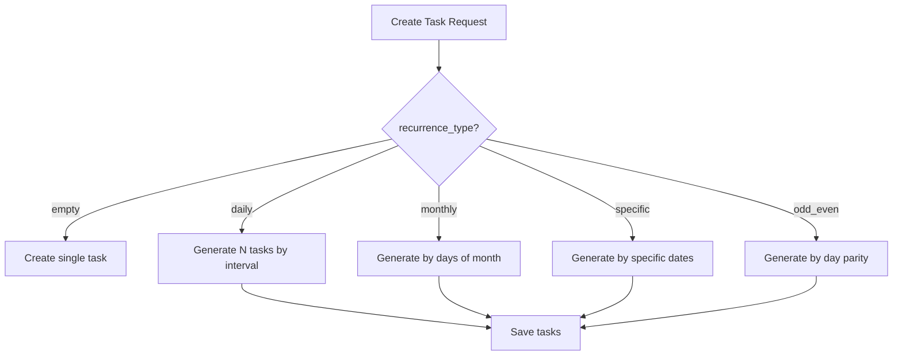

# 🩺 Task Service — Recurring Tasks Feature


---

## 🚀 Overview

Расширение существующего backend-сервиса трекера задач для медицинской системы.

Добавлена поддержка **периодических задач (recurring tasks)**, позволяющая автоматически создавать задачи по заданным правилам.

### Сервис ориентирован на сценарии:

* 📞 регулярные обзвоны пациентов
* 📊 периодическая отчётность
* 🏥 повторяющиеся медицинские процессы

---

## 📌 Описание

В рамках тестового задания реализована поддержка периодических задач в существующем API трекера задач.

### Поддерживаемые типы повторений:

* **daily** — каждые N дней
* **monthly** — в заданные дни месяца
* **specific** — в конкретные даты
* **odd_even** — в чётные или нечётные дни

---

## 🧠 Архитектурные решения

### 📦 Расширение модели

* `recurrence_type` — задаёт стратегию генерации
* `recurrence_data` — хранит параметры в формате JSON

#### Обоснование:

* гибкость (легко расширяется)
* отсутствие необходимости менять схему БД при добавлении новых типов

---

### 🔁 Генерация задач

Реализация: `usecase/task/service.go`

#### Подход:

* если `recurrence_type` пуст → создаётся одна задача
* если задан → генерируется серия задач

#### Ограничение:

```go
const maxOccurrences = 30
```

#### Обоснование:

* защита от неконтролируемого роста данных
* предсказуемое поведение системы

---

## 🧩 Валидация

Валидация реализована на уровне **usecase (бизнес-логики)**.

### Почему не в handler:

* не зависит от HTTP слоя
* переиспользуется
* проще тестировать

---

## 📦 Поддерживаемые форматы

### daily

```json
{ "interval": 2 }
```

* `interval > 0`

### monthly

```json
{ "days": [1, 15, 30] }
```

* значения от 1 до 31

### specific

```json
{ "dates": ["2026-04-20"] }
```

* формат: `YYYY-MM-DD`

### odd_even

```json
{ "type": "even" }
```

* допустимые значения: `odd`, `even`

---

## 🧾 Работа с JSON

### 🐛 Проблема

Изначально `recurrence_data` возвращался как строка:

```json
"{\"interval\":2}"
```

---

### ✅ Решение

Использован `json.RawMessage` в DTO:

```go
RecurrenceData json.RawMessage
```

Преобразование:

```go
raw = json.RawMessage(task.RecurrenceData)
```

---

### 🎯 Результат

API теперь возвращает корректный JSON:

```json
"recurrence_data": {
  "interval": 2
}
```

---

## 🐛 Проблема с миграциями

### Проблема:

* Docker использовал устаревший файл миграции
* несмотря на его удаление из проекта

### Причина:

* bind mount указывал на старый файл
* влияние OneDrive (кэширование / синхронизация)

---

### ✅ Решение:

* удалены старые миграции
* добавлен единый `init.sql`
* очищены volume:

```bash
docker compose down -v
```

---

### 💡 Обоснование

Для тестового задания выбран упрощённый подход.

В production использовались бы:

* `golang-migrate`
* `goose`
* versioned migrations

---

## 📊 Диаграммы

## ASCII 


## Mermaid 

 ```mermaid
flowchart TD

A[HTTP Handlers<br/>Gorilla Mux API] --> B[Usecase Layer<br/>Task Service]

B --> C[Validation Layer]
B --> D[Recurrence Engine<br/>Task Generation Logic]

D --> D1[Daily]
D --> D2[Monthly]
D --> D3[Specific Dates]
D --> D4[Odd / Even Days]

B --> E[Repository Layer]

E --> F[(PostgreSQL<br/>tasks table + JSONB)]

C --> B
D --> E
```


---

## 🧪 Testing

В проект добавлены unit-тесты для проверки бизнес-логики работы с периодическими задачами (recurrence).

Тесты реализованы на уровне usecase (service layer), что позволяет проверять логику независимо от HTTP и базы данных.

### 📂 Расположение
```
internal/usecase/task/service_test.go
```


### ✅ Покрытые сценарии

Реализованы тесты, проверяющие ключевые edge cases:

- ❌ Некорректный интервал для daily
  ```json
  { "interval": 0 }
  ```

→ ожидается ошибка

- ❌ Некорректная дата для specific
  ```json
  { "dates": ["2026-02-30"] }
  ```

→ ожидается ошибка (невалидная дата) 

**⚠️ Monthly с несуществующими датами**

- ❌ Некорректные дни для monthly
  ```json
  { "days": [31] }
  ```

→ невалидные даты (например, 31 февраля) автоматически пропускаются

**▶️ Запуск тестов**
  ```bash
go test ./internal/usecase/task -v
```

**💡 Обоснование**
- тестируется именно бизнес-логика, а не HTTP-слой
- используется mock репозитория (без БД)
- проверяются граничные случаи, а не только "happy path"

**Это позволяет:**

- гарантировать корректную работу recurrence-логики
- быстро выявлять ошибки при изменениях
- поддерживать предсказуемое поведение системы

---

## ⚖️ Принятые допущения

* задачи генерируются при создании, а не динамически
* `recurrence` не обновляется через Update
* используется UTC
* отсутствуют фоновые воркеры

---

## 📈 Возможные улучшения

* вынести `recurrence` в отдельную таблицу
* добавить cron-based генерацию
* добавить редактирование `recurrence`
* покрыть usecase тестами
* нормализовать `recurrence_data`

---

## 🧠 Почему это решение работает

- бизнес-логика изолирована от транспорта (HTTP)
- данные recurrence хранятся гибко (JSONB)
- генерация задач детерминирована и ограничена
- валидация централизована и тестируема

Это делает систему:

- расширяемой (можно добавить новые типы recurrence)
- предсказуемой
- устойчивой к некорректным данным

---

## 💬 Summary

### В рамках задания реализовано:

* ✔ корректная архитектура (разделение слоёв)
* ✔ гибкая модель через JSONB
* ✔ строгая валидация входных данных
* ✔ генерация задач по правилам
* ✔ исправление проблемы двойного JSON-кодирования
* ✔ решение проблемы с Docker миграциями

---

## ▶️ Run locally

```bash
docker compose up --build
```

**API будет доступен:**

```
http://localhost:8080
```

**Swagger:**

```
http://localhost:8080/swagger/index.html
```

---

## 🔍 Example Request

```bash
curl -X POST http://localhost:8080/api/v1/tasks \
-H "Content-Type: application/json" \
-d '{
  "title": "Daily calls",
  "description": "Test",
  "recurrence_type": "daily",
  "recurrence_data": { "interval": 2 }
}'
```

---

👉 Решение ориентировано на **расширяемость**, **предсказуемость** и **чистоту бизнес-логики**.
